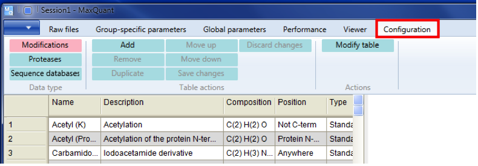
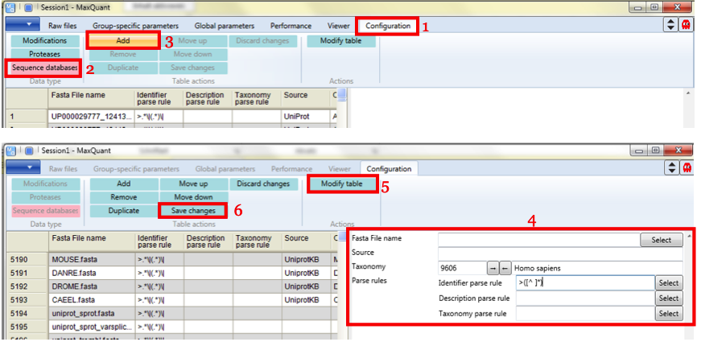
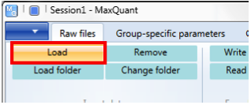
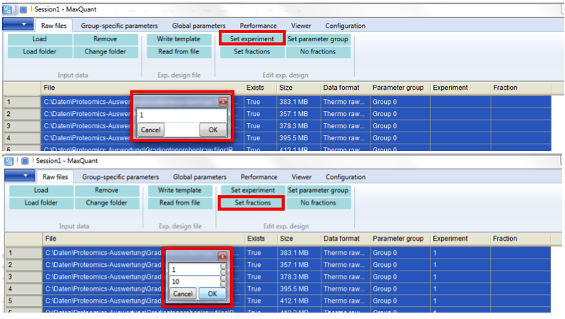
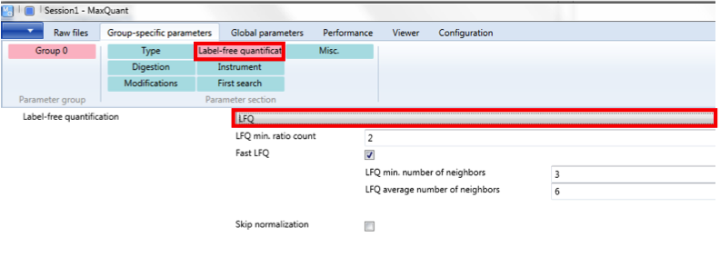
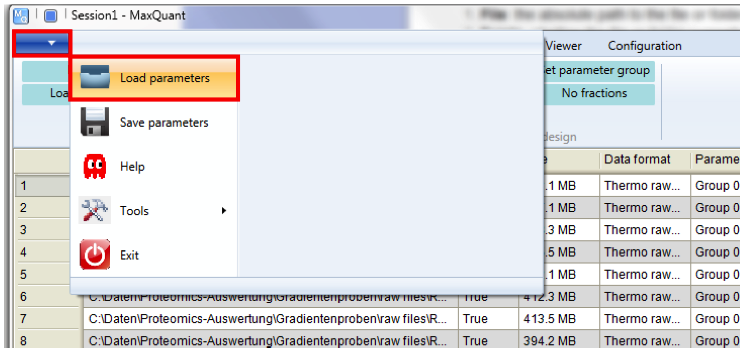

# **MaxQuant**

# MaxQuant Background

## 1.1 General
- [MaxQuant](http://www.coxdocs.org/doku.php?id=maxquant:start) is an integrated proteomics software suite designed for quantitative proteomics.
- The software package is tailored for analyzing shotgun proteomics data.
- Utilizes the integrated search engine Andromeda.
- Supports both label-free and label-based quantitation.
- Quantification is performed using the area under the curve (extracted ion currents - XIC) rather than spectral counting.
- Efficient for large search spaces, making it suitable for handling huge datasets and unspecific searches.

## 1.2 Download and Installation
- [Download and Installation Guide](http://www.coxdocs.org/doku.php?id=maxquant:common:download_and_installation)
- Registration with MaxQuant and ThermoFisher (TF) is required, especially for MSFileReader, which is needed for MS files from TF instruments.
- .NET Framework 4.5 or higher must be installed (refer to the MaxQuant download and installation guide).
- Set "Regional and Language Options" to English.
- Install MSFileReader (see the MaxQuant download and installation page).
- MaxQuant itself requires no installation; simply run the downloaded MaxQuant.exe (Andromeda is included in the MaxQuant download, standalone download necessary only if using it separately).

# MaxQuant Tutorial

## 2.1 General

- Start MaxQuant by double-clicking on MaxQuant.exe in the MaxQuant folder.

- Hovering the cursor over elements in MaxQuant will often produce an informative text.

- Ensure ample space on your hard drive, as MaxQuant generates numerous files. Running out of space may lead to crashes.

- If you are uncertain about a parameter's function, refrain from making changes.

- In case of issues or MaxQuant crashes:
  - Seek assistance from the [Google Group](http://www.coxdocs.org/doku.php?id=maxquant:common:google_groups).
  - Report bugs through the [Bug Reporting](http://www.coxdocs.org/doku.php?id=maxquant:common:bug_reporting) page.

## 2.2 Configuration of the Andromeda search engine

### 2.2.1 New Modifications (e.g., from Unimod)

- Ensure knowledge of the desired modification, utilizing databases like [Unimod](http://www.unimod.org/) for well-annotated modifications.
- Register with Unimod or log in as a guest.
- Search for the modification, noting the compositional change and other relevant information.
- In MaxQuant:
  - Configuration ➔ Modification ➔ Add
  - Provide a meaningful name and description for the modification.
  - Specify the compositional change using the periodic table or dropdown menu.
  - Define the position, type, new terminus, specificities, and other details.
  - Save the modification in MaxQuant for future use.
- Close and reopen MaxQuant for the changes to take effect.

### 2.2.2 Add a New Label (For Experiments with Labeled Proteins)

- Configuration ➔ Modifications ➔ Add
- Choose stable isotopes from the dropdown menu.
- Define masses for labeled isotopes, accounting for the difference from non-labeled counterparts.
- Type: Label
- Change amino acid, etc., as needed (similar to new modification).
- Click "Modify table" to view the new modification.
- Save changes and close MaxQuant, reopening for the changes to apply.

### 2.2.3 Configure a Protease

- Configuration ➔ Proteases ➔ Add
- Name and describe the protease.
- Specify cleavage patterns in the matrix, adjusting for specific amino acids.
- Modify the table, save changes, and reopen MaxQuant.

### 2.2.4 Add a Protein Database

- Automatically generate a reverse database (avoid using databases with pre-existing reverse sequences).
- Use the provided common contaminants list in MaxQuant.
- Download protein *.fasta files from sources like Uniprot/Ensemble.
- Add a new *.fasta file reference:
  - Configuration ➔ Sequence Database ➔ Add ➔ Select (on the very right)
- Keep the *.fasta file name unchanged for configuration recognition by MaxQuant.
- Define parse rules using regular expressions (see [C# Regular Expressions Cheat Sheet](http://www.mikesdotnetting.com/article/46/c-regular-expressions-cheat-sheet)).
- Add the taxonomic name or taxonomy number of the organism.
- Click the arrow to let MaxQuant complete this part of the form.
- Add parse rules according to the *.fasta file header.
- Click "Modify table" and "Save changes."
- Close and reopen MaxQuant for the changes to take effect.

## 2.3 Raw files
- load raw files (also, whole folders can be loaded, or you can just drag-and-drop your files)

### For Comparisons

- For accurate comparisons, it is advisable to search all samples together to ensure consistent protein group identification across samples.
- Assign parameter groups, experiment numbers, and fractions for effective grouping and analysis.
  
#### Parameter Group
- Define parameter groups based on factors such as SILAC vs. label-free samples or different proteases.
- Set group-specific parameters within each parameter group.

#### Experiment
- Samples with the same name in the experiment column are combined in the output.
- Examples include slices of one gel lane belonging to one experiment or technical replicates designated as different experiments (to prevent intensity combination).

#### Fractions
- Fractions refer to distinct subsets, such as slices of a gel lane, and are crucial for matching between runs.

#### Assigning Numbers
- Two possibilities for assigning numbers:
  1. **Write Template:**
    - Load files and click "write template."
    - This generates a subfolder named "combined" containing the "experimentalDesignTemplate.txt" file.
    - Open the "experimentalDesignTemplate.txt" in Excel, fill in your experimental design (fractions, names or numbers for experiments), and save as *.txt.
    - In MaxQuant, use "read from file" and choose the appropriate *.txt.
    - Highly recommended, especially for larger experiments. Note that parameter groups still need to be assigned directly in MaxQuant.

### Directly in MaxQuant

- Mark appropriate files directly in MaxQuant (multiple files can be selected simultaneously).
  - Set the experiment for the selected files.
  - Assign a number to those files.
  - Click "OK" to confirm.

- Similar process for fractions:
  - Mark the relevant files or define a range (e.g., 1-10 for gel slice 1-10 of one lane).
  - Set the experiment for the selected fractions.
  - Assign a number to the fractions.
  - Click "OK" to confirm.

## 2.4 MaxQuant Viewer

- The MaxQuant Viewer can be utilized for both unprocessed and processed data (loaded files).
- Offers a variety of visualization functions, including the correlation of identified features to MS spectra.
- In the left window, clicking in different corners reveals various control panels.
- For more detailed information, refer to [Tyanova et al. 2015, Proteomics 15, 1453-1456](https://onlinelibrary.wiley.com/doi/abs/10.1002/pmic.201400588).

## 2.5 Group-Specific Parameters

- Set group-specific parameters, especially if different parameter groups have been specified (e.g., for different proteases).

### 2.5.1 Type

- For labeled peptides:
  - Set labels accordingly.
- For label-free quantification (LFQ) or SILAC:
  - Leave Type as "Standard" (default) for label-free quantification (quantification on the MS1 level).
  - Set multiplicity to:
    - 1 for label-free (no labels; quantification occurs with LFQ).
    - 2 or 3 for SILAC (heavy, light, and intermediate peptides).
  - Select appropriate labels for labeled peptides (e.g., Arg10, Lys8 in the heavy channel, nothing in the light channel).

### 2.5.2 Digestion

- Specify digestion mode, enzyme, and the number of missed cleavages.
- Options:
  - Unspecific: No specified peptidase.
  - Semispecific: Suitable for peptide mixtures that might show partial degradation.
  - No digestion: If the *.fasta file specifies peptides directly.
  - Regarding trypsin/P: The commonly used definition is "Trypsin/P," which cleaves at the carboxyl side of lysine or arginine, even if a proline follows. Refer to the corresponding MaxQuant web page [here](http://www.coxdocs.org/doku.php?id=maxquant:andromeda:configuration:enzymes) for more details.

### 2.5.3 Modifications

- Set modifications; oxidation and N-terminal acetylation are set by default due to their high likelihood of occurrence.

### 2.5.4 Label-Free Quantification

- Set LFQ if labeled proteins were not used, and you want your proteins to be quantified.
- After searching and quantification, a 0 in the LFQ table does not imply protein absence but rather insufficient information.
- LFQ min ratio count = 1: One peptide ratio is sufficient to report a protein ratio, generally preferable.
- FastLFQ: Enabled by default but only active for >10 samples to speed up the process.
  - Minimum number of neighbors: Specifies the minimum number of neighboring samples for comparison (for bias correction introduced by pre-fractionation).
  - Average number of neighbors: Specifies the average number of files for comparison.

## 2.5.5 Skip Normalization

- Skip normalization: Generally left unchecked unless the LFQ algorithm's normalization fails, which might indicate that LFQ should not be used in that case.

## 2.5.6 Instrument

- Normally, nothing needs to be (or should be) changed, as necessary information is already contained in the *.raw files.

## 2.5.7 First Search

- First search is used for normalization.
- If a sample likely has many modifications, a first search without or with fewer modifications is used for normalization to speed up the process.
- A separate enzyme can be used for the first search (e.g., using trypsin for degraded peptide mixtures, where some peptides are full-length tryptic peptides for normalization).

## 2.5.8 Miscellaneous

- For SILAC experiments, turn on re-quantify (not necessary for label-free experiments). This re-quantifies against the noise if only one partner of a label pair is detected, thereby generating more data.
- Match type: Options for matching between runs and transfer of peptide identifications across runs. If different parameter groups exist, specify the matching type accordingly. If not, leave it as match from and to or choose no matching to deactivate matching between runs.

## 2.6 Global Parameters

### 2.6.1 Sequences

- Add file and load configured *.fasta-file(s) (multiple files can be loaded).
- Include contaminants (tick unless you have your own contaminants, then load a *.fasta file containing contaminants).
- Include fixed modifications if necessary.
- Set a minimum peptide length to avoid matching peptides to too many different proteins.
- For unspecific searches (protease not specified), higher confidence is necessary.

### 2.6.2 Identification

- Set peptide and protein FDRs (default: 1%).
- Site decoy fraction: FDR for specifying whether a peptide has a specific modification or not.
- Razor protein FDR: By default, Occam's razor is used, assigning a peptide to the protein group with the highest likelihood of being present in the sample.
  
### 2.6.3 Advanced Identification

- Second peptides: On by default. The second peptide algorithm allows the identification of both co-eluting and co-fragmented peptides from one MS/MS spectrum.
- Match between runs: Must be switched on here if wanted to be performed (default values can generally be left unchanged).
- Dependent peptides: Switch on if you want dependent peptides to be identified.

## 2.6.4 Protein Quantification

- Minimum ratio count: Relevant for SILAC; can be set to 1.
- Peptides for quantification: Choose between "all" peptides, "unique" peptides only, or a combination of unique and razor peptides (using the "unique + razor" option).
- Advanced ratio estimation: If checked, either the median of peptide feature ratios or the result of a regression analysis will be reported, automatically selecting the better-fitting method based on the data.

## 2.6.5 Label-Free Quantification

- Different parameter groups assigned: Allows separation of LFQs in parameter groups to avoid contribution to each other's normalization.
- Stabilize large ratios: On by default, useful for reliable ratios when dealing with very large ratios.
- Tick "iBAQ" for calculation of iBAQ-values (intensity-based absolute quantification of proteins).
- LFQ: Relative quantification for the same protein across different samples.
- iBAQ: Orthogonal comparison for different proteins in the same sample.
- iBAQ values can be normalized by dividing them by the sum of iBAQs in the sample to obtain relative iBAQs (riBAQs) [Shin et al. 2013, Nature Neuroscience 16, 365-374].

## 2.6.6 Tables

- Choose the tables needed (some are large and can impact search time).

## 2.6.7 Folder Locations

- Temporary folder: Place on SSD (if possible) for faster search.
- Combined folder: Where the actual output will be saved.
- Andromeda index: By default, index files in the Andromeda search are in the "search" folder within the "combined" folder. Generated index files can be shared between projects to save space on the hard drive (Andromeda index file ~ 1 GB).

## 2.6.8 MS/MS – FTMS, ITMS, TOF, Unknown

- Can normally be left at default settings.

## 2.6.9 Advanced

- Can normally be left at default settings.
- Disable MD5 sum: Skips calculation of MD5 sums on *.fasta files, useful for large *.fasta files to save time.

## 2.7 Performance

- Show all activities: Provides a detailed overview of everything MaxQuant is doing, useful for monitoring the process.

## 2.7.1 Number of Threads

- Each thread requires at least 2 GB of RAM.
- The number of threads should be less than or equal to the number of logical cores available to prevent MaxQuant crashes.

## 2.7.2 Start

- Initiates the search and quantification process.
- The search can be started in any header, but ensure all configurations are completed.
- If there is an error related to a corrupt file:
  - Confirm the file is genuinely corrupt (if so, copy the file anew).
  - Check if the MS file reader has a problem.

## 2.7.3 Partial Processing

- If MaxQuant crashes, the search can be resumed from different fallback positions (only applicable if not failed during the use of the search engine itself).
- If everything needs to be restarted, use the mqpar.xml file written upon starting to reload parameters. Use the button on the very right, next to "Raw files," to load the mqpar.xml.
- Alternatively, compare runs of SILAC *.raw files with and without re-quantification.

## References
- Cox et al. 2014, "Accurate proteome-wide label-free quantification by delayed normalization and maximal peptide ratio extraction, termed MaxLFQ," Molecular & Cellular Proteomics 13, 2513-2526.
- Tyanova et al. 2016, "The MaxQuant computational platform for mass-spectrometry-based shotgun proteomics," Nature Protocols 11, 2301-2319.
- [www.coxdocs.org](www.coxdocs.org)
- [msdn.microsoft.com/en-us/library/az24scfc.aspx](msdn.microsoft.com/en-us/library/az24scfc.aspx)
- [www.mikesdotnetting.com/article/46/c-regular-expressions-cheat-sheet](www.mikesdotnetting.com/article/46/c-regular-expressions-cheat-sheet)
- "Max Quant" YouTube Channel
